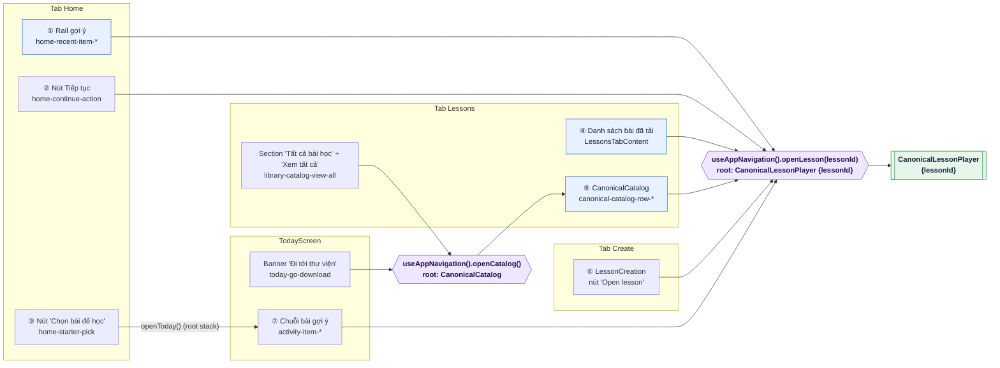
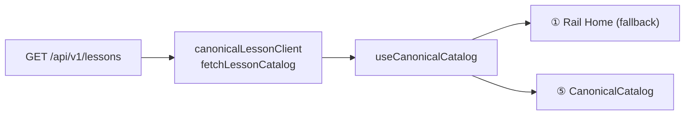

# Cổng vào bài học & danh sách bài học — Hiện trạng sau LING-179

> Cập nhật: LING-179 (TASK-001) · Base: `main` @ `5c5f8f6`
> Tài liệu mô tả hiện trạng code sau khi chuẩn hoá — các đề xuất
> khảo sát đã bị từ chối ([PROP] P-001–P-004) không còn được liệt kê.

---

## 1. Nguyên tắc

- **Một cổng code** vào player: `useAppNavigation().openLesson(lessonId)` —
  intent trong `@core/navigation`, cài đặt tại
  `src/app/navigation/appNavigationAdapter.ts` (xem
  [`navigation.md`](./navigation.md)). Helper cũ `lessonNavigation.ts` đã bị
  xoá trong đợt thiết kế lại điều hướng.
- **Một cổng code** vào catalog: `useAppNavigation().openCatalog()`.
- **Một nguồn duy nhất** cho `GET /api/v1/lessons`: `canonicalLessonClient`
  (`fetchLessonCatalog`) + `useCanonicalCatalog`. Client lệch schema
  `lessonCatalogClient` / `useLessonCatalog` đã bị xoá.
- Helper chỉ gom điều hướng (A-001): không thêm guard trước khi mở bài
  (A-004), không chống trùng event (A-003). Mở bài chưa tải vẫn được
  hỗ trợ như catalog đang làm (A-006).
- Analytics duy nhất được giữ: `unified_lesson_opened` /
  `source: home_rail` tại rail Home (DQ-004). Không cổng nào khác có
  analytics mới.

---

## 2. Bản đồ cổng vào (đã triển khai)

### 2.1 Chi tiết từng cổng

| # | Cổng | Code | Ghi chú |
| --- | --- | --- | --- |
| ① | Rail Home | `useHomeScreenController.openRecentItem` → `openLesson` · view `HomeScreenView.tsx` (`home-recent-item-*`) | Giữ event `unified_lesson_opened` (`source: home_rail`) đúng một lần. Ưu tiên bài đã tải; khi chưa có bài nào thì hiện tối đa 6 bài từ catalog (`UNIFIED_RAIL_LIMIT`). Cổng capability `isUnifiedLessonReady` đã bị bỏ. |
| ② | Tiếp tục bài đang học | `useHomeScreenController.onContinueStartedLesson` → `openLesson` · view `home-continue-action` | Bài đã tải + `in_progress`, hoặc trùng `continueLessonId` từ server. |
| ③ | Chọn bài (starter) | `useHomeScreenController.onNavigateLessonList` → `openToday()` · view `home-starter-pick` | Mở `Today` trên root stack; back quay về Home. Nhãn "Chọn bài để học" giữ nguyên (DQ-007). |
| ④ | Danh sách bài đã tải | `LessonsTabContent.handleLessonPress` → `openLesson` | Nguồn: `listDownloadedLessonSummaries()` qua `useLibrarySegments().packagedLessons`. Prop `personalLessons` (luôn rỗng) đã bị xoá. |
| ⑤ | Danh mục bài học | `CanonicalLessonCatalogScreen` → `openLesson` (`canonical-catalog-row-*`) | Nguồn: `useCanonicalCatalog` (client canonical, phân trang). |
| ⑥ | Tạo bài xong | `LessonCreationScreen` → `useCreateFlow().openCreatedLesson` → `finishCreate` (nút `lesson-creation-open`) | Mở bài mới khi `state.status === 'succeeded'`; luồng tạo bài bị xoá khỏi lịch sử nên back từ bài quay về tab đã bắt đầu tạo. |
| ⑦ | Today (kế hoạch học) | `TodayScreen.handleExecuteActivity` → `openLesson` / `openCatalog` / `openSpeakingRoom` / `openShadowing` / `openReview` | Vào từ nút ③ ở Home. Nút "Đi tới thư viện" (`today-go-download`) → `openCatalog`. Nút luyện nói → `openSpeakingRoom()` / `openShadowing()`. |

### 2.2 Cổng vào **danh sách** bài học

| Danh sách | Vào từ đâu | Nguồn dữ liệu |
| --- | --- | --- |
| Rail Home | Mở tab Home | Bài đã tải trước, rồi `useCanonicalCatalog` (tối đa 6). |
| `LessonsHistoryScreen` (segment Bài học) | Mở tab Lessons | Section "Bài học theo lộ trình": bài đã tải offline (`useLibrarySegments`). Section "Tất cả bài học": tối đa 5 bài từ `useCanonicalCatalog` (`CATALOG_PREVIEW_LIMIT`), kèm "Xem tất cả" → `openLessonCatalog`. |
| `CanonicalCatalog` | Nút "Xem tất cả" ở section "Tất cả bài học" (tab Lessons), banner Today — đều qua `openCatalog()` lên root stack | `useCanonicalCatalog` → `fetchLessonCatalog`. |
| Today | Nút `home-starter-pick` (root stack) | `adaptationEngine` + `todayNavigation`. |

---

## 3. Nguồn dữ liệu: client canonical duy nhất

- Contract: `src/core/schemas/lesson.ts` (`contract_version`, snake_case;
  Server sở hữu). Không đổi trong issue này.
- Mapping fallback Home: `toCanonicalRecentItem` nhận `LessonCatalogItem`
  (canonical): `meta` = `description`, hoặc `${sentence_count} câu` khi
  mô tả rỗng.
- Đã xoá: `lessonCatalogClient.ts` (`fetchLessonCatalogPage`,
  `UnifiedLessonSummary*`), `useLessonCatalog.ts`, barrel export và test
  của chúng. Static search không còn production import tới các symbol này.
- Đã xoá: producer/prop `personalLessons` (`useLibrarySegments`,
  `LessonsHistoryScreen`, `LessonsTabContent`).

---

## 4. Điều hướng và đăng ký route

> Thay thế bởi đợt thiết kế lại điều hướng — xem [`navigation.md`](./navigation.md).

- `CanonicalLessonPlayer`, `CanonicalCatalog`, `Today`, `SpeakingRoom` và
  các màn Shadowing đăng ký **một lần** trên root stack, phía trên tab bar.
  Back luôn quay về tab đã mở màn đó; tab bar tự bị che nên không cần
  `IMMERSIVE_STACK_ROUTES` (đã xoá).
- `home-starter-pick` mở `Today` qua `openToday()` (DQ-003/DQ-006).

---

## 5. Những thứ cố ý không đổi (ngoài phạm vi LING-179)

- Player internals, logic tải offline.
- Đã xoá tại LING-180: `CurriculumLessonsEntry` + `curriculumLessonSelection`
  (`fetchPublishedCurriculumLessons`, `CurriculumLessonSelection*`) cùng barrel
  export và test của chúng.
- Schema camelCase phía Server (→ follow-up LING-181).
- Nhãn/bố cục (DQ-007), analytics mới hay `source` mới (DQ-004).
- Contract test cho catalog (P-001), event `unified_catalog_opened`
  (P-002), i18n cho `LessonCreationScreen` (P-003), luật lint mới (P-004).
