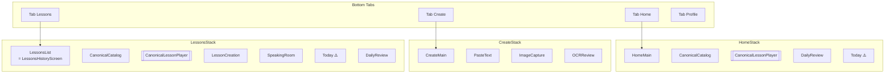
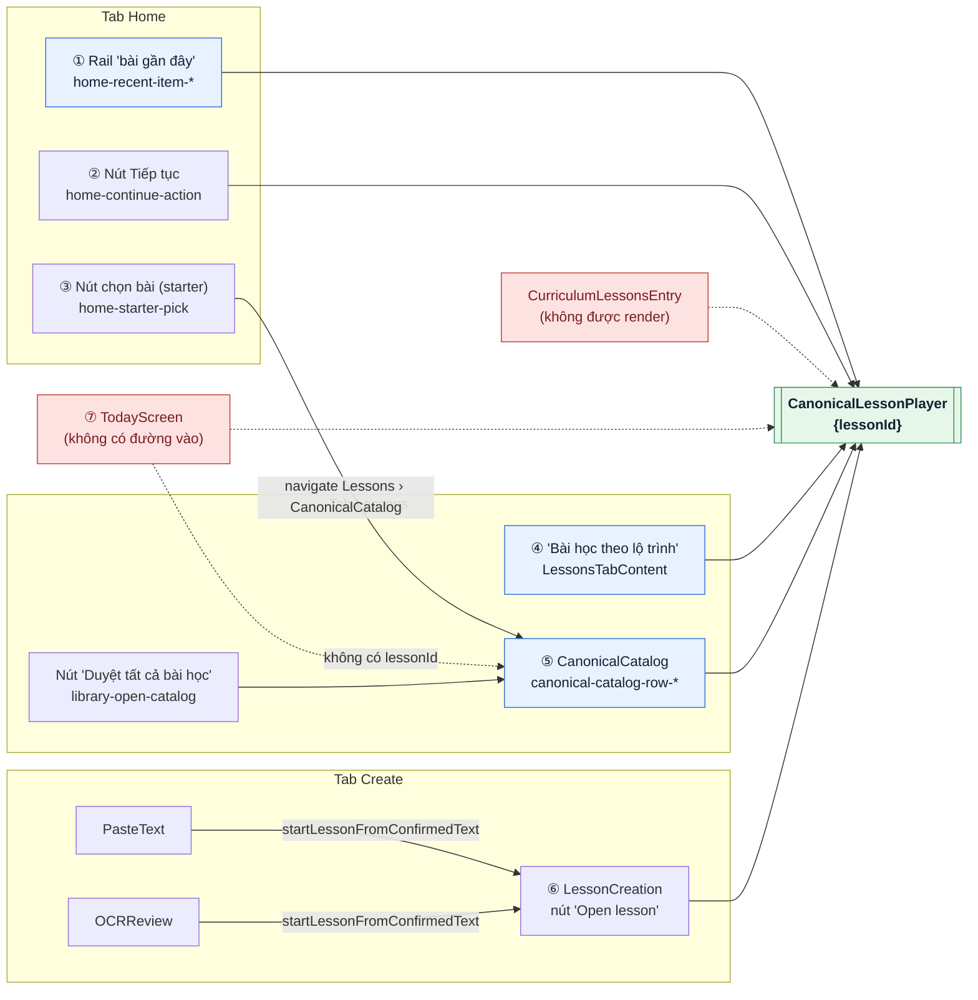
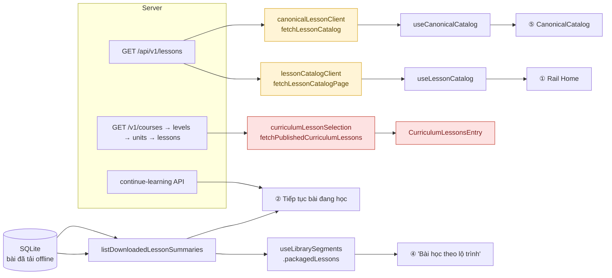
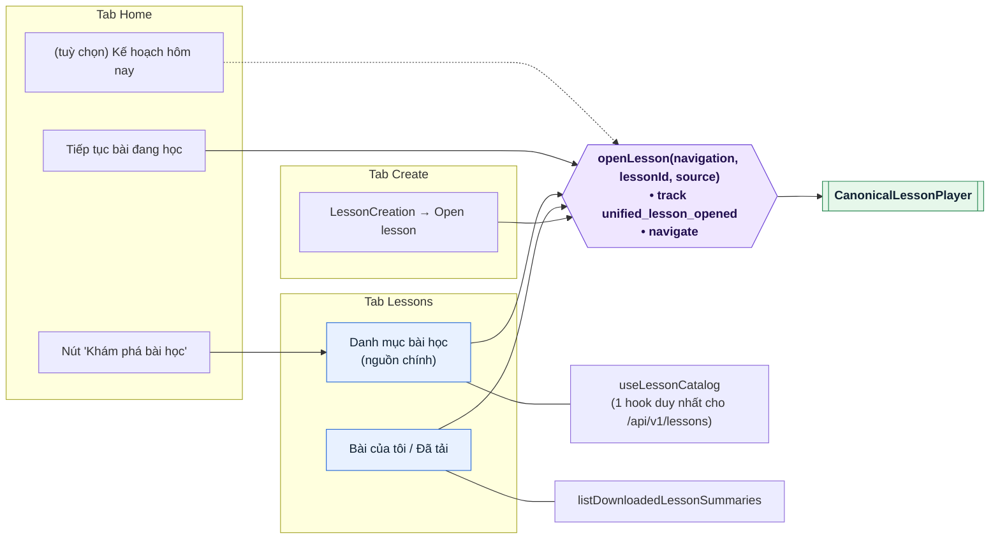
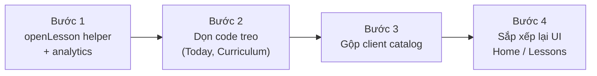

# Cổng vào bài học & danh sách bài học — Hiện trạng và hướng giải quyết

> Ngày khảo sát: 2026-10-01 · Branch: `claude/gifted-albattani-kd5dwh`
> Phạm vi: mọi đường dẫn người dùng tới **màn danh sách bài học** và **màn học bài** (`CanonicalLessonPlayer`).
> Tài liệu chỉ mô tả và đề xuất — **chưa có thay đổi code nào**.

---

## 1. Tóm tắt nhanh

| Hạng mục | Hiện trạng |
| --- | --- |
| Màn học bài | **1** màn duy nhất: `CanonicalLessonPlayer({lessonId})` ✅ |
| Nơi đăng ký route player | 2 stack (`Home`, `Lessons`) — hợp lý với app dạng tab |
| Cổng mở bài hoạt động | **7** chỗ gọi `navigate('CanonicalLessonPlayer')` (6 file) |
| Danh sách bài học trên UI | **4** danh sách, từ **4 hook / 3 nguồn dữ liệu** khác nhau |
| Code "treo" | `TodayScreen` (không có đường vào), `CurriculumLessonsEntry` (không được render) |
| Analytics | Chỉ **1/7** cổng gửi event `unified_lesson_opened` |
| Tên gọi lệch nội dung | "Bài học theo lộ trình" thực ra là **bài đã tải offline**; rail Home "bài gần đây" thực ra là **N bài đầu catalog** |

Vấn đề chính **không nằm ở player** mà ở **lớp danh sách / điều hướng phía trước**: nhiều danh sách trùng vai trò, mỗi nơi tự gọi `navigate`, tự fetch dữ liệu.

---

## 2. Cấu trúc điều hướng hiện tại



Nguồn: `src/app/navigation/AppNavigator.tsx` (Home stack dòng ~60–90, Lessons stack dòng ~130–175).
`CanonicalLessonPlayer` nằm trong `IMMERSIVE_STACK_ROUTES` (`src/app/navigation/immersiveTabRoutes.ts`) → ẩn tab bar khi học.

---

## 3. Bản đồ cổng vào (hiện trạng)



### 3.1 Chi tiết từng cổng

| # | Cổng | File:dòng | Điều kiện hiển thị | Analytics |
| --- | --- | --- | --- | --- |
| ① | Rail Home | `src/features/home/logic/useHomeScreenController.ts:169` · view `HomeScreenView.tsx:355` | `unifiedMode` bật; lấy `canonicalItems.slice(0, UNIFIED_RAIL_LIMIT)` | ✅ `unified_lesson_opened` (`source: home_rail`) |
| ② | Tiếp tục bài đang học | `useHomeScreenController.ts:198` · view `HomeScreenView.tsx:149` | Có `startedDownload` (bài đã tải + `in_progress`, hoặc trùng `continueLessonId` từ server) | ❌ |
| ③ | Chọn bài (starter) | `useHomeScreenController.ts:190` | Chưa có bài đang học nhưng đã có ≥1 bài tải về | — (chỉ chuyển sang catalog) |
| ④ | "Bài học theo lộ trình" | `src/features/lesson/library/components/LessonsTabContent.tsx:91` | Tab Lessons › segment `lessons`, có bài đã tải | ❌ |
| ⑤ | Danh mục bài học | `src/features/lesson/player/screens/CanonicalLessonCatalogScreen.tsx:83` | Vào từ ③ hoặc nút "Duyệt tất cả bài học" (`LessonsHistoryScreen.tsx:160`) | ❌ |
| ⑥ | Tạo bài xong → "Open lesson" | `src/features/lesson/player/screens/LessonCreationScreen.tsx:200` | `PasteTextScreen` / `OCRReviewScreen` → `startLessonFromConfirmedText` → `LessonCreation`, trạng thái `succeeded` | ❌ |
| ⑦ | Today (kế hoạch học) | `src/features/today/screens/TodayScreen.tsx:75` + `logic/todayNavigation.ts` + `logic/adaptationEngine.ts:192,241,263` | **Không có màn nào gọi `navigate('Today')`** | ❌ |
| — | Curriculum entry | `src/features/lesson/player/components/CurriculumLessonsEntry.tsx:98` | **Chỉ được export, không màn nào render** | ❌ |

### 3.2 Cổng vào **danh sách** bài học

| Danh sách | Vào từ đâu | Ghi chú |
| --- | --- | --- |
| Rail Home | Mở tab Home | Là "catalog thu nhỏ", không phải lịch sử |
| `LessonsHistoryScreen` (segment Bài học) | Mở tab Lessons | Hiển thị bài **đã tải offline** |
| `CanonicalCatalog` | Nút ③ ở Home, nút "Duyệt tất cả bài học" ở tab Lessons, fallback của Today | Đăng ký ở **cả 2 stack** → từ Home bấm ③ sẽ **nhảy sang tab Lessons**, không ở lại stack Home dù Home stack cũng có route này |
| Today | (không có) | — |
| Curriculum | (không có) | — |

---

## 4. Nguồn dữ liệu phía sau các danh sách



Phát hiện:

1. **Hai client gọi cùng một endpoint `GET /api/v1/lessons`**:
   `src/features/lesson/player/logic/lessonCatalogClient.ts` (dùng bởi `useLessonCatalog` cho Home) và
   `src/features/lesson/player/logic/canonicalLessonClient.ts` (dùng bởi `useCanonicalCatalog` cho màn catalog).
   → Hai hook, hai bộ state/pagination, hai cách xử lý lỗi cho cùng một dữ liệu.
2. **Nhãn sai nội dung**: section "Bài học theo lộ trình" (`LessonsTabContent.tsx:~84`) lấy từ `listDownloadedLessonSummaries()` (`useLibrarySegments.ts:50`) và gắn `subjectLabel: 'Offline'` → thực chất là "Bài đã tải".
3. **`personalLessons` luôn rỗng** (`useLibrarySegments.ts:48` → `useMemo(() => [], [])`) nhưng vẫn được truyền xuống `LessonsTabContent`.
4. **Rail Home** đặt tên `recentItems / openRecentItem` nhưng dữ liệu là N bài đầu catalog, không phải bài gần đây.
5. **Curriculum** dùng một hệ phân cấp API thứ ba (`/v1/courses…`) mà UI không còn dùng.

---

## 5. Danh sách vấn đề

| Mã | Vấn đề | Mức độ | Ảnh hưởng |
| --- | --- | --- | --- |
| P1 | 7 chỗ tự gọi `navigate('CanonicalLessonPlayer')`, không có hàm chung | Trung bình | Khó thêm logic chung (analytics, guard, prefetch) |
| P2 | Chỉ 1/7 cổng có analytics | Trung bình | Không đo được người dùng vào bài từ đâu |
| P3 | 2 client + 2 hook cho cùng `GET /api/v1/lessons` | Trung bình | Trùng code, dễ lệch hành vi giữa Home và Catalog |
| P4 | Tab Lessons có 2 danh sách trùng vai trò (nút catalog + "lộ trình") | Trung bình (UX) | Người dùng không rõ nên vào đâu |
| P5 | Nhãn "Bài học theo lộ trình" / "bài gần đây" sai nội dung | Thấp–Trung bình (UX) | Gây hiểu nhầm |
| P6 | `TodayScreen` đăng ký 2 stack nhưng không có đường vào | Thấp | Code chết trên UI, vẫn phải bảo trì |
| P7 | `CurriculumLessonsEntry` + `fetchPublishedCurriculumLessons` không được dùng | Thấp | Code chết, comment còn nhắc route cũ `CurriculumLesson` |
| P8 | `personalLessons` luôn rỗng | Thấp | Prop/nhánh render thừa |

---

## 6. Hướng giải quyết

### 6.1 Kiến trúc mục tiêu



Nguyên tắc:

- **Một cổng code** vào player: `openLesson(...)`.
- **Một nguồn** cho catalog server: một hook, một client.
- **Mỗi tab một vai trò**: Home = tiếp tục học + lối tắt; Lessons = duyệt & bài của tôi; Create = tạo bài.
- **Tên hiển thị đúng dữ liệu**.

### 6.2 Lộ trình theo bước (rủi ro tăng dần)



#### Bước 1 — Gom lệnh mở bài (giải quyết P1, P2) · Rủi ro: thấp

- Tạo `src/features/lesson/player/logic/openLesson.ts`:
  ```ts
  export type LessonOpenSource =
    | 'home_rail' | 'home_continue' | 'library_downloaded'
    | 'catalog' | 'creation' | 'today';

  export function openLesson(
    navigation: {navigate: (s: 'CanonicalLessonPlayer', p: {lessonId: string}) => void},
    lessonId: string,
    source: LessonOpenSource,
  ) {
    trackEvent('unified_lesson_opened', {lesson_id: lessonId, source});
    navigation.navigate('CanonicalLessonPlayer', {lessonId});
  }
  ```
- Export qua `src/features/lesson/player/index.ts`, thay 6 call site (①②④⑤⑥⑦).
- Unit test cho helper + cập nhật test hiện có nếu có assert `navigate`.
- Không đổi UI/hành vi; chỉ **thêm** event analytics.

#### Bước 2 — Dọn code treo (P6, P7, P8) · Rủi ro: thấp · **Cần quyết định**

| Đối tượng | Phương án A | Phương án B |
| --- | --- | --- |
| `TodayScreen` | Thêm lối vào từ Home (thẻ "Kế hoạch hôm nay") | Gỡ route `Today` khỏi 2 stack, giữ code `features/today` |
| `CurriculumLessonsEntry` + `fetchPublishedCurriculumLessons` | Xoá (kèm test) — **đề xuất** | Gắn vào tab Lessons |
| `personalLessons` | Xoá prop + nhánh render | Giữ nếu sắp có tính năng "bài của tôi" |

#### Bước 3 — Gộp client catalog (P3) · Rủi ro: trung bình

- Chọn **một** client cho `GET /api/v1/lessons` (đề xuất giữ `lessonCatalogClient` + `useLessonCatalog` vì đã có pagination và `enabled`).
- Chuyển `CanonicalLessonCatalogScreen` sang `useLessonCatalog`; giữ `canonicalLessonClient` cho các endpoint còn lại (detail, analysis, revisions, lesson-creations), bỏ `fetchLessonCatalog`.
- Cần kiểm tra schema item (`LessonCatalogItem`) hai bên có khớp không trước khi gộp.

#### Bước 4 — Sắp xếp lại UI (P4, P5) · Rủi ro: trung bình · **Cần quyết định sản phẩm**

- Tab Lessons: catalog là danh sách chính (có thể nhúng trực tiếp thay vì nút "Duyệt tất cả"); section bài đã tải đổi tên thành **"Bài đã tải"** / "Bài của tôi".
- Home: giữ "Tiếp tục bài đang học"; rail đổi tên thành **"Gợi ý cho bạn"** hoặc thay bằng bài gần đây thật (cần dữ liệu lịch sử).
- Nút ③ ở Home: quyết định mở catalog **trong Home stack** (giữ ngữ cảnh tab) hay chuyển tab như hiện tại.

### 6.3 Những thứ **không** nên đổi

- **Giữ player đăng ký ở cả Home stack và Lessons stack.** Với app có tab, điều này giúp nút back quay về đúng tab xuất phát. Chuyển lên root stack sẽ đổi hành vi back mà lợi ích nhỏ.
- **Giữ `IMMERSIVE_STACK_ROUTES`** để ẩn tab bar khi học.

---

## 7. Checklist kiểm thử sau khi thay đổi

- [ ] Mỗi cổng ①–⑥ mở đúng bài, tab bar ẩn, back quay về đúng màn trước.
- [ ] Event `unified_lesson_opened` có đúng `source` cho từng cổng.
- [ ] Không còn import tới file đã xoá (`tsc`, `eslint` sạch).
- [ ] Test điều hướng hiện có (`src/app/navigation/__tests__/*`, `src/features/home/logic/__tests__/navigationTypeSafety.test.ts`, `task008-retired-routes.test.ts`) vẫn xanh.
- [ ] Catalog ở Home và ở tab Lessons hiển thị cùng dữ liệu sau Bước 3.
